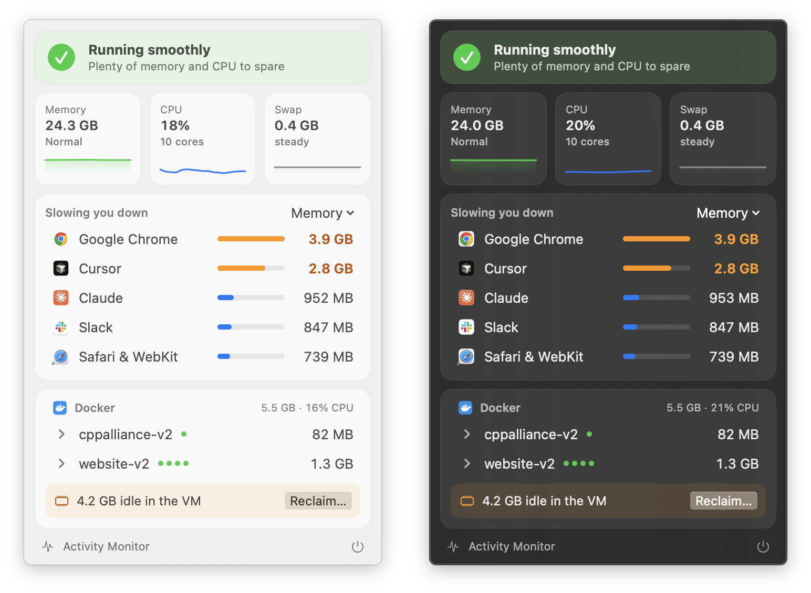

# MemWatch

A tiny macOS menu bar app that tells you if your Mac is fast or slow right now, and which apps are to blame.



## What it shows

- **A verdict.** Running smoothly, a bit busy, or slowing down, with the reason. It uses macOS's own memory pressure level, whether swap is growing, and CPU held high for 30 seconds.
- **Memory, CPU and swap** with 15 minute sparklines.
- **Top apps** by memory or CPU, with helper processes grouped under their app. Hover a row to quit it.
- **Docker**, if it's running. Containers grouped by compose project, with stop and start on hover. When the Docker VM is holding a lot more memory than its containers use, it offers to restart Docker and brings your containers back up after.

The menu bar icon is a gauge that turns orange or red when your Mac is busy or slow.

## Built to be cheap

A monitor shouldn't slow down the thing it's watching.

- No child processes. Per-app numbers come from libproc and Docker's API socket, not `top`, `ps` or the `docker` CLI.
- With the popover closed it only reads a few kernel counters every 5 seconds. About 15 MB and ~0% CPU.
- With the popover open it scans apps every 2 seconds and Docker every 4. About 25 MB and ~1% of one core.

## Install

Needs macOS 14 or later and the Xcode command line tools.

```sh
git clone https://github.com/julioest/memwatch.git
cd memwatch
./build.sh
open MemWatch.app
```

To start it at login, add `MemWatch.app` in System Settings > General > Login Items.

## Notes

- Processes owned by other users (WindowServer, system daemons) aren't listed. macOS doesn't let a regular app read them, and you can't quit them anyway.
- Docker support expects Docker Desktop at `/Applications/Docker.app` with its socket at `~/.docker/run/docker.sock`.
- The build is ad hoc signed, so it's meant to run on the Mac you build it on.

## License

MIT
