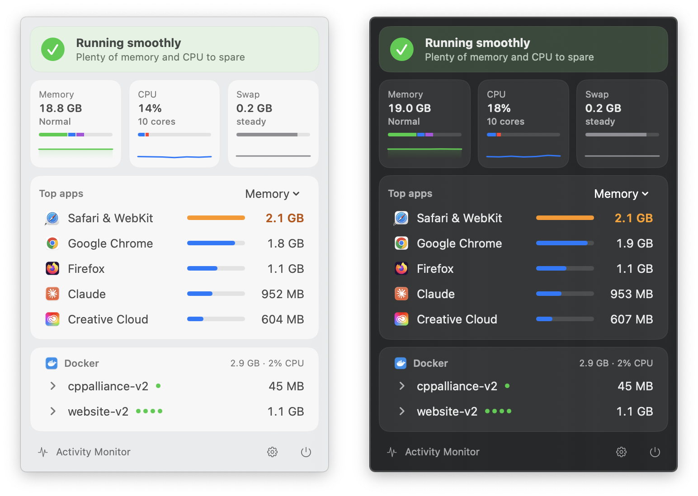
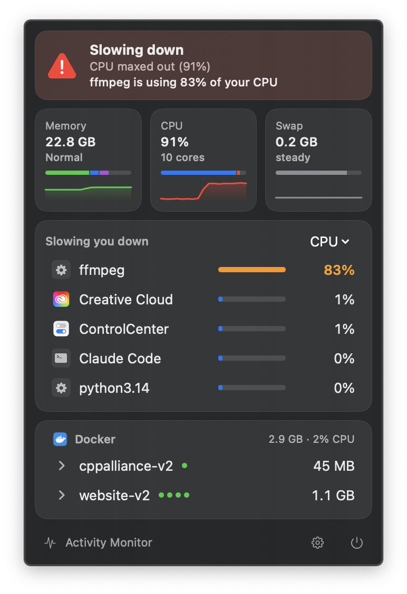
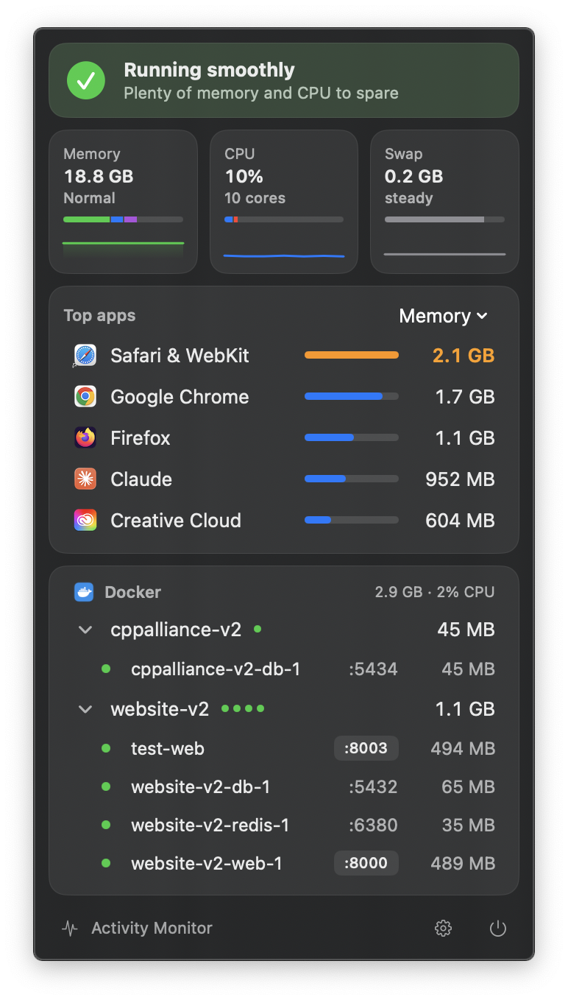
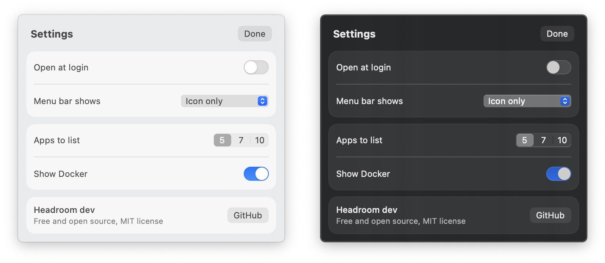

# Headroom

[](https://github.com/julioest/headroom/releases/latest)

[](LICENSE)

A tiny macOS menu bar app that tells you if your Mac is fast or slow right now, and which apps are to blame.



## Why I built it

I use Docker every day for work, usually with a few copies of the same site running on different ports. When my Mac slowed down I wanted a quick, lightweight way to see what I could free up, without digging through Activity Monitor.

## What it shows

- **Status line:** *Running smoothly*, *A bit busy* or *Slowing down*, plus the reason and the app responsible, like "Chrome is using 6.1 GB". It goes by macOS's own memory pressure level, whether swap is growing, whether CPU stays high for 30 seconds, whether macOS is throttling a hot CPU, and whether the disk is almost full.
- **Memory, CPU and swap:** each with a graph of the last 15 minutes and a breakdown bar. Memory splits into app, wired and compressed. CPU splits into user and system time. Swap shows how full the startup disk is, since that's where swap lives.
- **Top apps:** the apps using the most memory or CPU, with helper processes counted under their app. Hover a row to quit the app.
- **Docker:** containers grouped by compose project, if Docker is running. Hover to stop or start them, click a port to open it in your browser, and stop any container that keeps crashing. When the Docker VM holds a lot more memory than its containers use, or Docker stops responding, Headroom offers to restart Docker, then starts the containers that were running.

The menu bar icon is a capsule that fills up as your Mac gets busy. The empty space at the top is your headroom. It turns orange when your Mac is busy and red when it's slow.

<p>
  
  
</p>

Click the gear for **Settings**: open at login, show `MEM` or `CPU` percent next to the icon, how many apps to list, and whether to show Docker.



## Performance

Headroom doesn't run `top`, `ps` or the `docker` CLI. It reads app numbers from `libproc` and asks Docker's API socket for the rest.

| Menu | Checks | Memory | CPU |
|---|---|---|---|
| Closed | a few kernel counters every 5 s | ~15 MB | ~0% |
| Open | apps every 2 s, Docker every 4 s | ~25 MB | ~1% of one core |

## Install

Download the `.dmg` from the [latest release](https://github.com/julioest/headroom/releases/latest), open it and drag **Headroom** to **Applications**. Needs **macOS 14 or later**, on Apple Silicon or Intel.

Headroom isn't signed with an Apple Developer ID yet, so macOS blocks it the first time:

1. Open Headroom. macOS says it can't verify the app. Click **Done**.
2. Go to **System Settings › Privacy & Security**, scroll down and click **Open Anyway** next to the Headroom message.
3. Open Headroom again and confirm.

Or clear the block from Terminal:

```sh
xattr -dr com.apple.quarantine /Applications/Headroom.app
```

To start it at login, turn on **Open at login** in Headroom's settings.

### Build from source

Needs the Xcode command line tools.

```sh
git clone https://github.com/julioest/headroom.git
cd headroom
./build.sh
open Headroom.app
```

`./release.sh 0.1.0` builds the universal app and packages the `.dmg` and `.zip` into `dist/`.

## Notes

- Processes owned by other users, like `WindowServer` and system services, aren't listed. macOS doesn't let a regular app read them, and you can't quit them anyway.
- Docker support expects Docker Desktop at `/Applications/Docker.app`, with its socket at `~/.docker/run/docker.sock`.

## License

[MIT](LICENSE)
